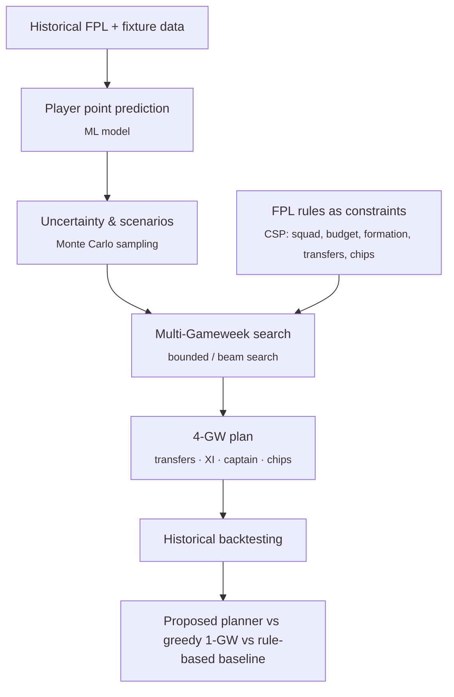

# NextGW

**Multi-Gameweek Fantasy Premier League planning under uncertainty.**

NextGW is a planning system for FPL managers. It takes uncertain player forecasts and searches over *sequences* of decisions (transfers, starting XI, captain, chips) across the next four Gameweeks, instead of optimising one week at a time.

> **Research question:** Does multi-Gameweek search over uncertain player-performance forecasts produce better FPL decisions than optimising only the current Gameweek?

## Why

A greedy strategy picks the player with the best fixture *this* week. But FPL is a sequential decision problem: budget, free transfers, club limits and chips carry over, and a move that wins this Gameweek can cost the next three. NextGW treats squad management as constrained sequential planning and tests, on historical seasons, whether looking ahead actually pays off.

## How it works



| Course concept | Where it is used |
|---|---|
| Search | Finite-horizon search over sequences of FPL actions |
| Constraint satisfaction | Legal squads, line-ups, formations, budgets, club limits, transfers and chips |
| Probability & uncertainty | Predictive distributions and sampled future scenarios |
| Machine learning | Supervised player-point prediction from historical features |
| Utility / optimisation | Expected cumulative points net of transfer hits and chip costs |

## Evaluation

All decisions are replayed on past seasons using **only information available before each Gameweek deadline** — no future results, prices, transfers or injury news.

- **Primary metric:** cumulative FPL points over the backtest period
- **Secondary:** points per Gameweek, transfer hits, captain points, chip contribution, decision stability, runtime
- **Prediction quality:** MAE / RMSE, reported separately from planning performance
- **Ablations:** planning horizon (1 vs 2 vs 4 GW), deterministic vs scenario-based uncertainty, search budget, baseline vs ML predictor

## Repository layout

| Path | Purpose |
|---|---|
| `data/` | Ingestion and leakage-safe player-by-Gameweek dataset |
| `prediction/` | Feature engineering, model training, prediction API |
| `uncertainty/` | Predictive distributions and scenario generation |
| `fpl/` | FPL rules as constraints; squad, line-up and transfer validation |
| `planning/` | Search state, actions, objective and multi-GW search |
| `baselines/` | Rule-based conventional and greedy 1-GW strategies |
| `backtesting/` | Historical simulator, metrics and experiment runner |
| `dashboard/` | Demo interface for a recommended 4-GW plan |
| `configs/` | Experiment and FPL rule configuration |
| `notebooks/` | Exploration only; reusable logic lives in the packages |
| `tests/` | pytest suite |

## Getting started

Requires Python 3.11+ and [uv](https://docs.astral.sh/uv/).

```bash
git clone https://github.com/CandyButcher27/NextGW.git
cd NextGW
pip install uv
uv sync
uv run pytest
```

Data preparation, experiment and demo commands will be added here as each module lands.

## Status

Early development: module scaffolding, team workflow and CI are in place; module implementations are in progress.

| Weeks | Milestone |
|---|---|
| 1 | Data sources, FPL rules specification, interfaces |
| 2–3 | Clean historical dataset, prediction baseline and ML model |
| 4–5 | FPL state + CSP validation, uncertainty model and scenarios |
| 6–7 | Baselines, backtesting simulator, initial multi-GW search |
| 8–9 | End-to-end integration, full backtests |
| 10–12 | Ablations, evaluation, dashboard, report |

## Team — HackerPeople

| Member | Role |
|---|---|
| Vidhan Jain | Planning & search |
| Jhavi Dasari | ML prediction |
| Harsh Gunda | Data engineering |
| Tarun RK | CSP & FPL rules |
| Hrithik Shukla | Uncertainty & scenarios |
| Triyansh Agarwaal | Baselines & backtesting |
| Tanishq | Evaluation & analysis |
| Aryaman Srivastava | Integration, UI & reproducibility |

## Contributing

Each module has one owner. Work happens on `<github-username>/<topic>` branches and reaches `main` only through a pull request that passes:

- **`ci`** — the test suite, plus a check that the PR only touches paths its author owns (`.github/CODEOWNERS`)
- **`review`** — an automated Claude review against the project rules

The full workflow and conventions are in [`AGENTS.md`](AGENTS.md); coding agents read it automatically.

## References

**Official FPL rules (2026/27)** — [Picking a squad](https://www.premierleague.com/en/news/2174419) · [Managing your team](https://www.premierleague.com/en/news/2174899) · [Transfers](https://www.premierleague.com/en/news/2174907) · [Chips](https://www.premierleague.com/en/news/2174900)

**Related work**
- [FPL-Auto](https://github.com/bentindal/FPL-Auto) — ML-driven FPL manager; closest prior work on the prediction/automation side
- [ScoutIQ](https://github.com/Akshay8087/ScoutIQ-Football-Intelligence-Match-Prediction-Platform) — football data exploration, feature engineering and prediction pipelines
- [xGModel](https://github.com/AnshChoudhary/xGModel) and [Football-xG-Predictor](https://github.com/bsobkowicz1096/Football-xG-Predictor) — expected-goals modelling
- [Football-analytics](https://github.com/vickyfriss/Football-analytics) — football analytics and feature ideas
